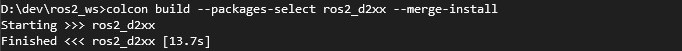
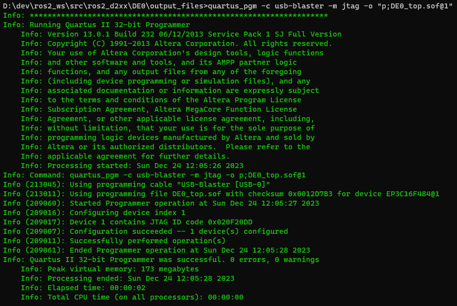
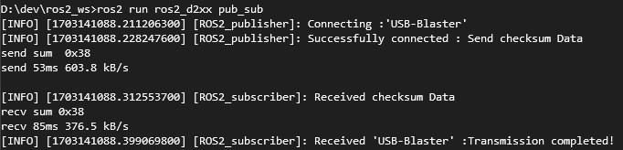
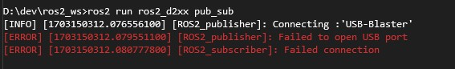

# ros2_d2xx
> 將 FTDI USB與Altera 連接的USB-blaster 使用 ROS2 編譯並執行驗證USB是否順利接通

## Getting Started 
燒錄好DE0 Broad的硬體電路

* 需要預先安裝整個ROS2 Humble 環境 [ros2-humble install Windows(source)](https://docs.ros.org/en/humble/Installation/Alternatives/Windows-Development-Setup.html)
* 預先燒入Altera DE0 Broad  : DE0_top.sof 文件在 /DE0/output_files 中
### Environment
* Windows10
* Altera DE0 Board
* [FTDI D2XX Driver](https://ftdichip.com/drivers/d2xx-drivers/)
### Prerequisites 
* Quastus II 13.0 sp 1(64-bit)
* Vistual Studio 2022 
* ROS2 humble
* FTDI D2XX Library

### Create Project with VS2022/cmd.exe
```bash
call D:\humble\install\local_setup.bat                 # set ros2 env.
mkdir \path\ros2_ws\src                                # create  ros2 workspace Folder 
cd ros2_ws\src                                         # into folder
ros2 pkg create --build-type ament_cmake ros2_d2xx     # create new package
```
### Build Project with VS2022/cmd.exe

```bash
cd ros2_ws/src
git clone https://github.com/ericchuanggit/ros2_d2xx    # replace created package
call D:\humble\install\local_setup.bat                  # set whole ros2 env.
call install\local_setup.bat                            # set created package env.
colcon build --packages-select ros2_d2xx --merge-install # build ros2 package with colcon build
```
* Colcon Build<br>


## Burn the DE0_top.sof file into the DE0 board
```bash
D:\dev\ros2_ws\src\ros2_d2xx\DE0\output_files>quartus_pgm -c usb-blaster -m jtag -o "p;DE0_top.sof@1"
```
* Burn in FPGA

## Usage ros2_d2xx package 
```bash
ros2 run ros2_d2xx pub_sub
```

## Result
* Success Connection<br>


* Failure Connection<br>



## Authors 
* **Dr. Shih-An Li**
* **Eric Chuang** 
 


